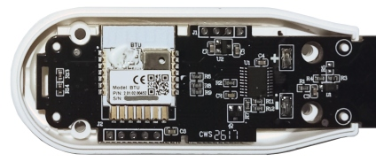
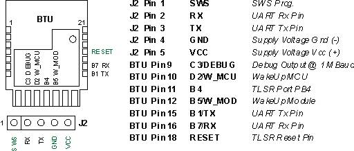

# SGS01 BTHome  
Custom firmware for the Tuya SGS01 soil sensor to send data in standard BTHome format.

Project status/history:	<br>
23.08.2025 Started alpha test with 4 devices<br>
28.08.2025 Version 1.0 published<br>
05.08.2026 Started reseach and development for the new SGS01B hardware<br>

**NOTE:** 
Since 2026 there is a new sensor version "SGS01B" with a BTH module in the market.
Firmware V1.1 to support the new model currently in development.


## Sensor

 

 Model: SGS01 / HZ-SL05 / "Connected Home PLANT MONITOR" / PID gvygg3m8<br>
 Model: SGS01B / "Connected Home PLANT MONITOR" / PID gpkyrocn<br>
 Manufacturer: Shenzhen HaiHao Electronic Co.LTD<br>
 Firmware: Tuya Cloud Protocol


##  Custom Firmware Features

- Bluetooth Low Energy
- Advertising sensor data in BTHome V2 format
- BTHome V2 data encryption supported
- Alternative data formats: BTHome V1, Xiaomi
- BLE GATT profile to configure and secure the sensor
- Supporting OTA for firmware updates
- Extended battery life time

## Description

- The sensor is a well designed "plant monitor" with water protection and two AAA batteries for long operation
- Hardware design<br>
  There are to versions of the sensor on the market:<br>
  SGS01: TUYA BT3L bluetooth module (TLSR8250 chip, 512k flash)<br>
  SGS01B: TUYA BTU bluetooth module (TLSR8250 chip, 512k flash)<br>
  A third party MCU to measure data, control button and LED.
- The Tuya module communicates with the MCU over UART serial, TUYA third party MCU.
- The custom firmware replaces the BT3L/BTU module firmware, handles the MCU serial protocol and send the sensor data in BTHome format. 

## Flashing the custom firmware

Note: When flashing the custom BTHome firmware, the sensor won't work with the Tuya cloud.

- Unmount the 4 screws in the battery case and remove the back cover.
   <br><br>
   SGS01: 
  
   
   
   <br><br>
   SGS01B:
   
   
   
   


- TELINK BDT
  [BDT Tool](https://wiki.telink-semi.cn/wiki/IDE-and-Tools/Burning-and-Debugging-Tools-for-all-Series/ ""): Flashing by TELink Buring and debugging tool.
  Connect:
>   *Sensor Vcc - BDT 3V3*<br>
    *Sensor Gnd - BDT GND*<br>
    *Sensor SWS - BDT SWM*

  Select chip type B85 to flash (old BDT software type 8258).
- PVVX
  [TlsrComSwireWriter](https://github.com/pvvx/TlsrComSwireWriter ""):
  Flashing by "USB/TTL adapter" and PVVX python script.
  Connect:
>   *Sensor Vcc - TTL 3V3 (ensure 3.3V power)*<br>
    *Sensor Gnd - TTL Gnd*<br>
    *Sensor SWS - TTL RxTx*<br>
    *Sensor Reset - TTL Rts*

- If the sensor firmware was updated by OTA, erase flash address range 0x00000 - 0x3FFFF. DO NOT erase flash above 0x70000, here is the manufactor pre-programmed area (MAC address and chip calibration data).    
- May read out the original firmware (first 128k bytes) before flashing.
- Firmware files are located in the subdirectory **/fw**.
- Flash the xxx.bin file at start address 0x00000.
 
Notes

- SGS01B + BDT Tool: May press short the sensor button immediate after "Activate" to get a power on reset for the SWS activation. Before flashing the first custom firmware "Unlock" the flash.
- SGS01B: To receive the battery voltage in mV within BTHome data an extra soldered wire is required, see manual. 

## Getting Started    

- No time? Just flash the module and insert batteries. The sensor will start up in connection mode (LED flashing) and changes after 60 seconds to measure mode - advertising BTHome data.   
- For configuration and encryption have a look at the manual. [```PDF```](wiki/SGS01-BTHome-Manual.pdf)    

## TODO's    

- Check long time battery usage

## Links    

- BTHome Format [```https://bthome.io/```](https://bthome.io/)    
- TELink Wiki [```https://wiki.telink-semi.cn/wiki```](https://wiki.telink-semi.cn/wiki)    
- TUYA MCU Protocol [```https://developer.tuya.com/en/docs/mcu-standard-protocol/mcusdk-protocol```](https://developer.tuya.com/en/docs/mcu-standard-protocol/mcusdk-protocol)    

## Licence
- Open Source [Apache License, Version 2.0](http://www.apache.org/licenses/LICENSE-2.0)  
Unless required by applicable law or agreed to in writing, software
distributed under the License is distributed on an "AS IS" BASIS,
WITHOUT WARRANTIES OR CONDITIONS OF ANY KIND, either express or implied.
See the License for the specific language governing permissions and
limitations under the License.
- Copyright (c) 2025-2026, haraldapp, [```https://github.com/haraldapp```](https://github.com/haraldapp)
  
<br>
  
**Thanks to**
+ [pvvx](https://github.com/pvvx) for excellent work on TLSR chips
+ [tofuSCHNITZEL](https://github.com/tofuSCHNITZEL) for SGS01B research and testing
+ Shelly/Allterco for defining an open standard and registering the BTHome UUIDs at the Bluetooth SIG organisation


